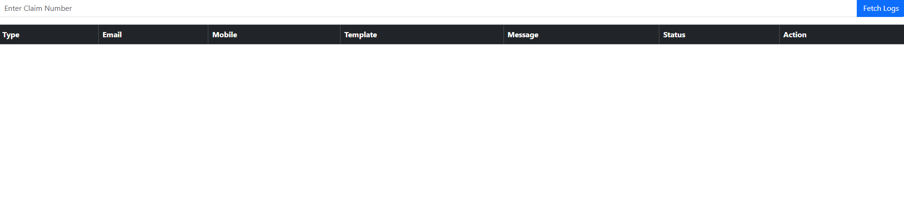

# Communication POC

This project demonstrates how to fetch communication logs and retrigger failed ones.

## Steps

### Step 1: Enter Claim Number

Type the claim number in the input box.

### Step 2: View Logs

The grid displays both Email and SMS communication logs along with their current status.

### Step 3: Retrigger Failed Email

Locate a failed email record and click the **Retrigger** button to resend the communication.

### Step 4: Success Message

After the retrigger operation completes successfully, a confirmation message is displayed and the grid is refreshed.

### Step 5: Updated Status

Verify that the communication status has been updated in the grid.

